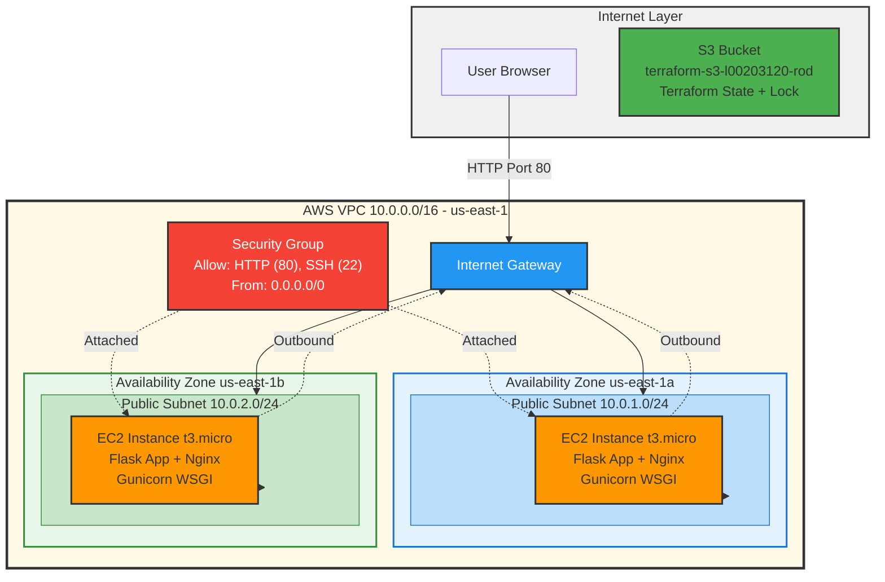
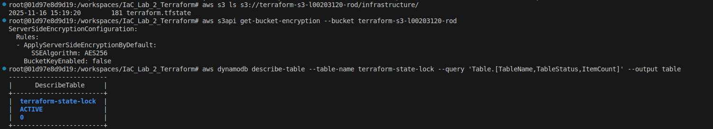
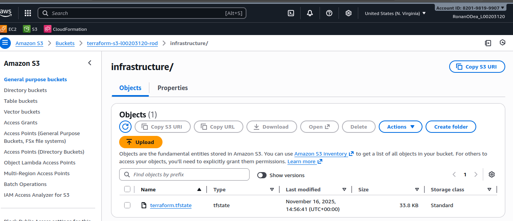
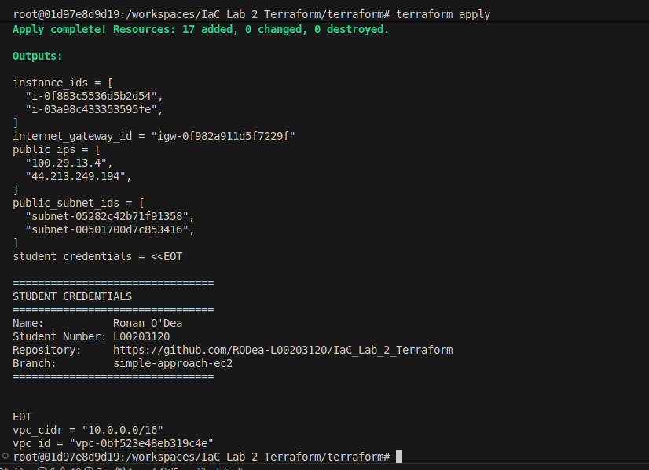
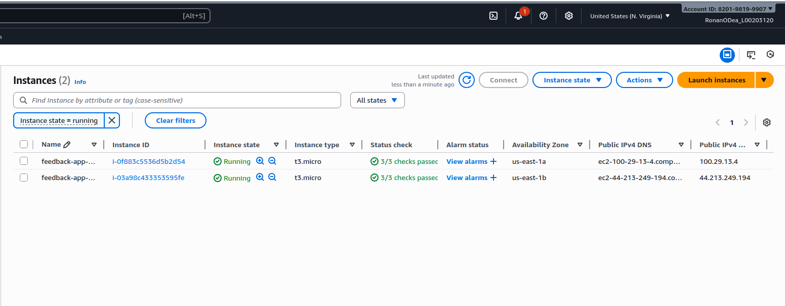
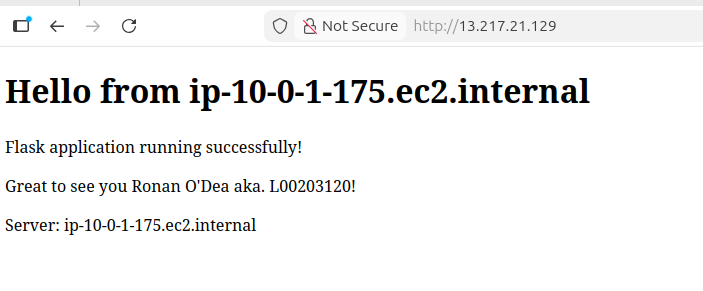
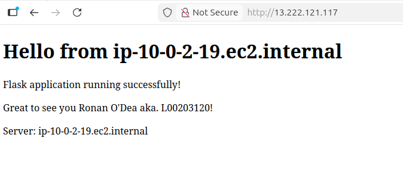

# IaC_Lab_2_Terraform

Repository in support of academic report for Lab 2's prescribed topic.

This repository provides a means of Version Control and evidences the following:

The authors engagement in practitioner-based research in effort to compose a IaC solution for a hypothetical DevOps pipeline.

- The proposed scenario is the provision of infrastructure for the deployment of a feedback mechanism for employees in an organization.

- While the landing page is simplistic (a form), reliability, security, modularity and scalability are of concern and therefore the underlying architecture design aimed for is as follows:

## Infrastructure Architecture



## Early Design decisions

- Create a dev container for version locking, portability and maintainability.

- Use terraform locally through the CLI, avoid vendor locked cloud implementation and instead store state configuration files on a private S3 bucket. Less provider dependence, similar security, greater flexibility and portability. Until HCP stack configurations are required. 

- Modular reusable design as is effective, consider when simple, declarative approach may be better

- Simple Python Flask App - Hello world to begin, then form submission; nothing complex to focus on infrastructure. 

- Aiming to implement multi-cluster cluster approach however:

1. Get EC2 instances working with correctly configured VPC, Security Groups, in own branch.

2. Branch off  above to work on single-cluster EKS implementation with ALB applied 

- (consideration for cost - validate -> plan ->apply > document evidence -> destroy)

3. Branch off above to work on multi-cluster implementation

4. Merge most successful to main

# State Tracking

While of less concern as a solo developer, best practice indicates a method of tracking the state of terraform IaC changes is required when working with others to avoid conflicts, corruptions, race conditions etc. 
Rather than rely on cloud tooling (Terraform HCP) to track state changes the author investigated alternatives and encountered the concept of provisioning a private, encrypted S3 bucket to store an organizations `terraform.tfstate` file. A script file is included which runs through this process. *Note: as this is container based the visible user name is the default docker debian container root* 

Below are evidence of this working:






## Stage 1: Simple Infrastructure set-up

The author intended modularity to be a core design element for this lab and incrementally developed the application.

A branch was created to implement two EC2 instances on public networks, from there the following could be implemented:

- A VPC module, configurable via the `terraform/variables.tf` file which pass to the vpc module `terraform/modules/vpc/main.tf` as required. 

- An EC2 module which retrieves the latest AWS-Linux 2023 AMI and allows for configuration of instances via variables passed from the `terraform/variables.tf` file

Examples of variables configured as per the brief instructions in `terraform/variables.tf` include: 

```hcl
variable "vpc_cidr" {
  description = "CIDR block for VPC"
  type        = string
  default     = "10.0.0.0/16"
}

variable "availability_zones" {
  description = "List of availability zones"
  type        = list(string)
  default     = ["us-east-1a", "us-east-1b"]
}

variable "public_subnet_cidrs" {
  description = "CIDR blocks for public subnets"
  type        = list(string)
  default     = ["10.0.1.0/24", "10.0.2.0/24"]
}
```
## Stage 1: Conclusions

Following successful formatting, validation, planning and apply from the container cli:


Within AWS GUI:



Accessing public facing IP(note IP differs to above due to minor bug fix and redeploy):




____________________________________________

Improvements to be made: Implement an automated version control for the flask app and install script either via S3 bucket or GitHub

This somewhat monotlithic approach is potentially error prone in terms of configuration - for instance above the author realized that updating the python application folder obviously did not automatically update the user_data.sh script - therefore deployment was referencing an older hard coded version. 

The author decided at this point to investigate the deployment using a Kubernetes - container based approach for reliability, scalability and deployment error prevention.

This still provided a learning opportunity in IaC deployment automation. The project will be forked from here and further developed; with aim to re-use modules created where appropriate. 
______________________________________________________________________