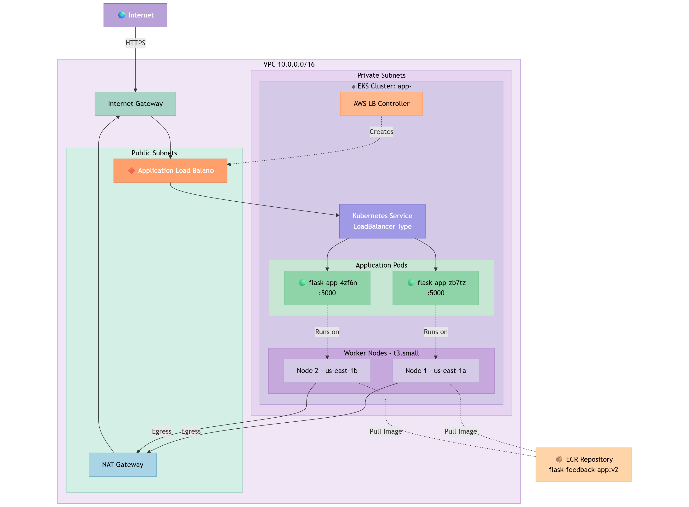
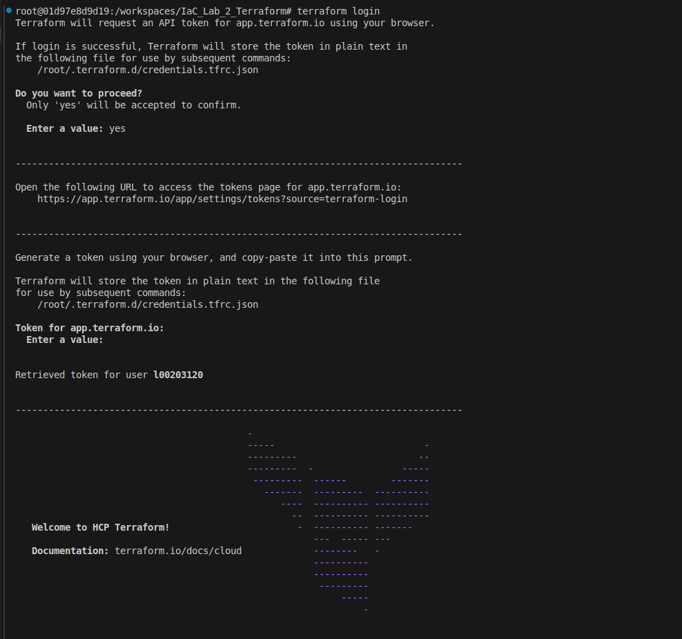

# IaC_Lab_2_Terraform

Repository in support of academic report for Lab 2's prescribed topic.

This repository provides a means of Version Control and evidences the following:

The authors engagement in practitioner-based research in effort to compose a IaC solution for a hypothetical DevOps pipeline.

- The proposed scenario is the provision of infrastructure for the deployment of a feedback mechanism for employees in an organization.

- While the landing page is simplistic (a form), reliability, security, modularity and scalability are of concern and therefore the underlying architecture design aimed for is as follows:

## Infrastructure Architecture for Stage 2:



## Stage 2 Design decisions

- Configured HCP Cloud Account to allow for single cluster approach and potentially use terraform stacks.



- Configured private sub-nets using same modular approach as before. Logic is:  `terraform/variables.tf` defines variables passed to `terraform/main.tf` which are passed to  `modules/vpc/main.tf` which are expected as defined in `modules/vpc/variables.tf`. A single NAT gateway is configured to allow next step.

``` HCL
# terraform/main.tf

variable "private_subnet_cidrs" {
  default = ["10.0.10.0/24", "10.0.20.0/24"]
}
variable "enable_nat_gateway" {
  default = true
}
variable "single_nat_gateway" {
  default = true
}

```

- Create EKS Module. Place EKS nodes on private sub-nets with a single NAT configured for access (two best practice but double the cost). 

``` HCL
 # EKS Configuration in `terraform/variables.tf`
variable "cluster_name" {
  description = "EKS cluster name"
  type        = string
  default     = "feedback-app-eks"
}

variable "cluster_version" {
  description = "Kubernetes version"
  type        = string
  default     = "1.31"
}

variable "node_instance_types" {
  description = "Instance types for EKS nodes"
  type        = list(string)
  default     = ["t3.medium"]
}

variable "node_group_min_size" {
  description = "Minimum number of EKS nodes"
  type        = number
  default     = 2
}

variable "node_group_max_size" {
  description = "Maximum number of EKS nodes"
  type        = number
  default     = 4
}

variable "node_group_desired_size" {
  description = "Desired number of EKS nodes"
  type        = number
  default     = 2
}
```

### AWS Load Balancer Controller Integration

Instead of manually creating an ALB module, Phase 2 uses **Kubernetes-native load balancing**:

- Installed AWS Load Balancer Controller via Helm
- Kubernetes Service type `LoadBalancer` automatically provisions ALB
- Controller manages ALB lifecycle (create, update, delete)
- Benefits: Better integration, automatic updates, Kubernetes-native workflow
```yaml
# k8s/service.yaml
apiVersion: v1
kind: Service
metadata:
  name: flask-feedback-app
  annotations:
    service.beta.kubernetes.io/aws-load-balancer-type: external
    service.beta.kubernetes.io/aws-load-balancer-scheme: internet-facing
spec:
  type: LoadBalancer  # Creates ALB automatically
  selector:
    app: flask-feedback-app
  ports:
  - port: 80
    targetPort: 5000
```

**Installation:**
```bash
# Created IAM policy and service account with IRSA
# Installed controller via Helm chart
helm install aws-load-balancer-controller eks/aws-load-balancer-controller \
    -n kube-system \
    --set clusterName=app- \
    --set serviceAccount.name=aws-load-balancer-controller
```
## Application Containerization

### Dockerfile Creation

Containerized the Flask application for Kubernetes deployment:
```dockerfile
FROM python:3.11-slim

WORKDIR /app

COPY app/requirements.txt .
RUN pip install --no-cache-dir -r requirements.txt

COPY app/app.py .
COPY app/templates/ templates/

EXPOSE 5000

CMD ["gunicorn", "-w", "2", "-b", "0.0.0.0:5000", "app:app"]
```

**Key decisions:**
- **Python 3.11-slim**: Smaller image size (~150MB vs 1GB+ with full Python)
- **Gunicorn**: Production WSGI server (2 workers for t3.small nodes)
- **Multi-stage not needed**: Simple app, minimal dependencies

### Amazon ECR (Elastic Container Registry)
```bash
# Created repository
aws ecr create-repository --repository-name flask-feedback-app

# Built and tagged image
docker build -t flask-feedback-app:v2 .
docker tag flask-feedback-app:v2 \
    820198199907.dkr.ecr.us-east-1.amazonaws.com/flask-feedback-app:v2

# Pushed to ECR
docker push 820198199907.dkr.ecr.us-east-1.amazonaws.com/flask-feedback-app:v2
```
## Kubernetes Deployment Strategy

### Deployment Manifest
```yaml
# k8s/deployment.yaml
apiVersion: apps/v1
kind: Deployment
metadata:
  name: flask-feedback-app
spec:
  replicas: 2  # Multi-instance for HA
  selector:
    matchLabels:
      app: flask-feedback-app
  template:
    spec:
      containers:
      - name: flask
        image: 820198199907.dkr.ecr.us-east-1.amazonaws.com/flask-feedback-app:v2
        ports:
        - containerPort: 5000
        resources:
          requests:
            memory: "256Mi"
            cpu: "250m"
          limits:
            memory: "512Mi"
            cpu: "500m"
        livenessProbe:
          httpGet:
            path: /
            port: 5000
          initialDelaySeconds: 30
        readinessProbe:
          httpGet:
            path: /
            port: 5000
          initialDelaySeconds: 5
```

**Design Decisions:**
- **2 Replicas**: High availability across 2 AZs
- **Resource Limits**: Prevent pod from consuming all node resources
- **Health Probes**: Kubernetes automatically restarts unhealthy pods
- **Liveness Probe**: Checks if app is responsive (restart if not)
- **Readiness Probe**: Checks if pod ready to receive traffic

### Key Configuration Changes for Phase 2

**Enable EKS Deployment:**
```hcl
# terraform/variables.tf
variable "enable_eks" {
  description = "Enable EKS cluster deployment"
  type        = bool
  default     = false  # Set to true to deploy EKS
}
```

**Instance Type Adjustment:**
```hcl
# Changed from t3.medium to t3.small for educational account
variable "node_instance_types" {
  default = ["t3.small"]  # Free tier eligible
}
```

**Staged Deployment Process:**
1. **Stage 1**: Deploy with `enable_eks = false` (VPC + NAT only)
2. **Stage 2**: Set `enable_eks = true` via HCP Terraform UI variables
3. Trigger new plan and apply

This two-stage approach resolves EKS module count dependencies without using `-target` flag.

### State Tracking

HCP workspace now stores state - no manual configuration of S3 bucket and DynamoDB lock required. Somewhat locking in to vendor for future stack implementation.

### Security Improvements

Phase 2 provides better security posture:
- Application in private subnets (not directly accessible)
- No SSH required (kubectl for management)
- IAM Roles for Service Accounts (granular permissions)
- Network policies possible (future enhancement)


## Stage 2: Conclusions & Deployment Screentshots
