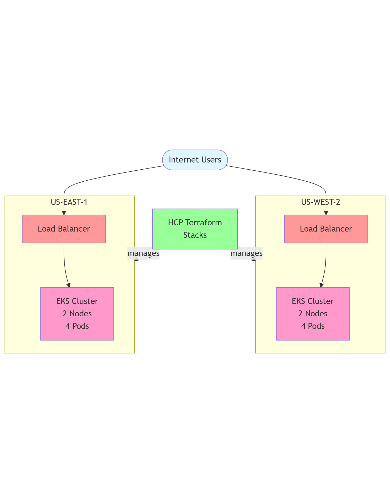
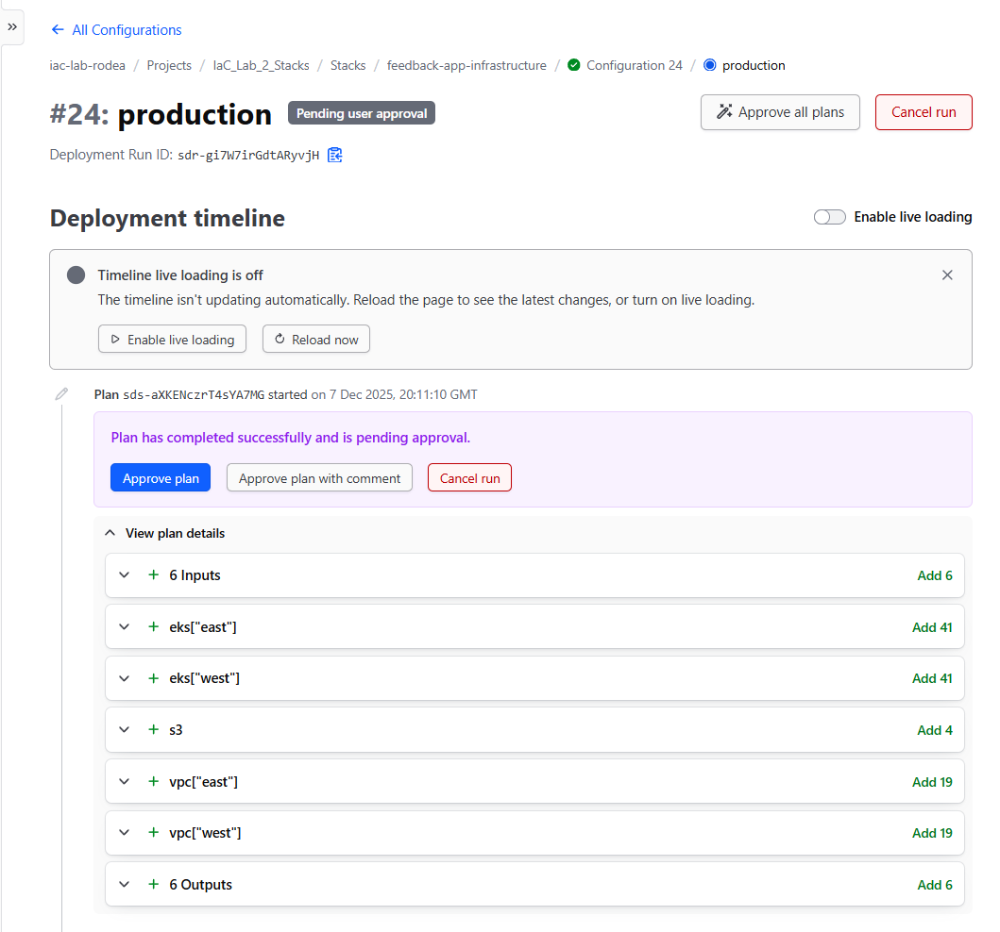
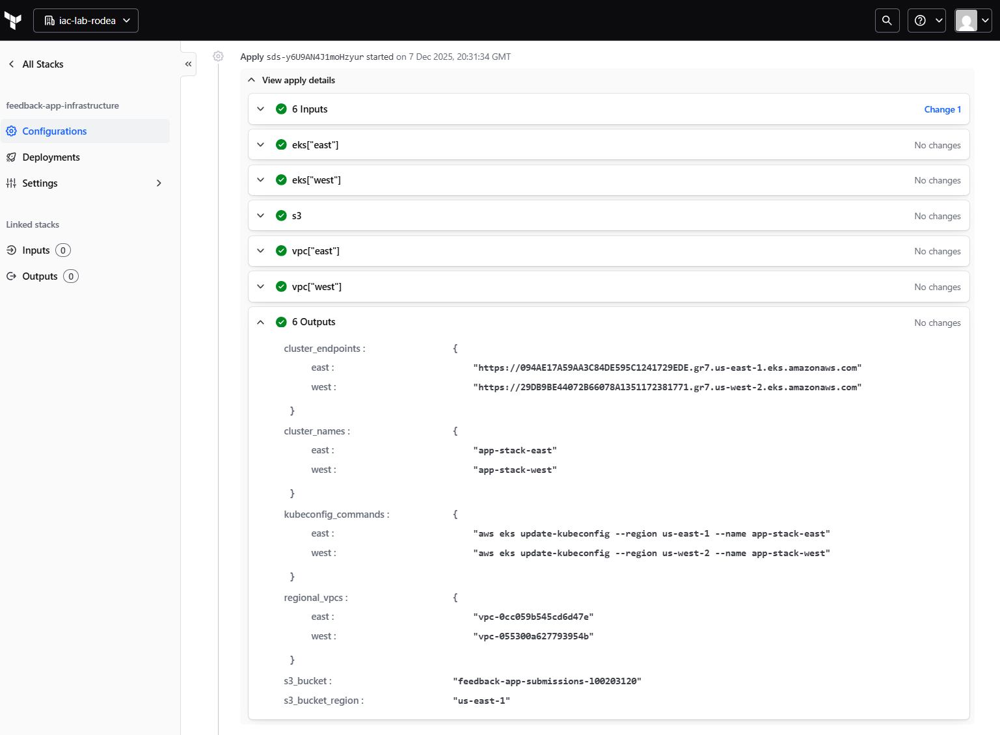
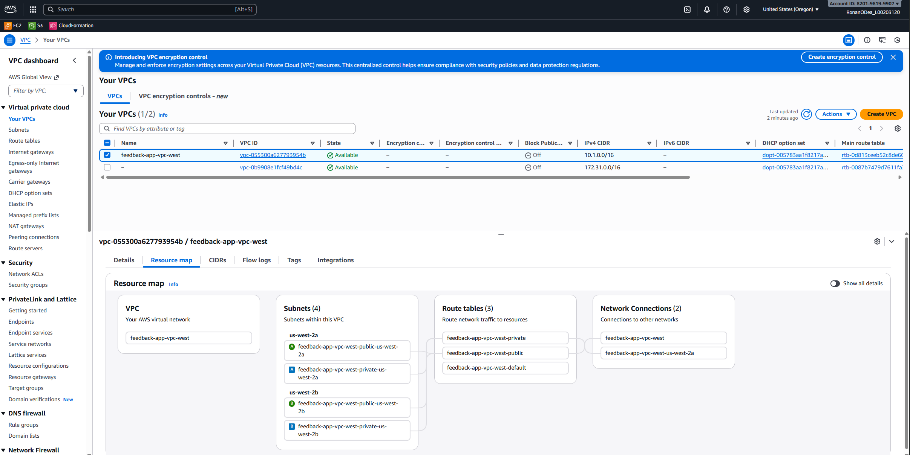
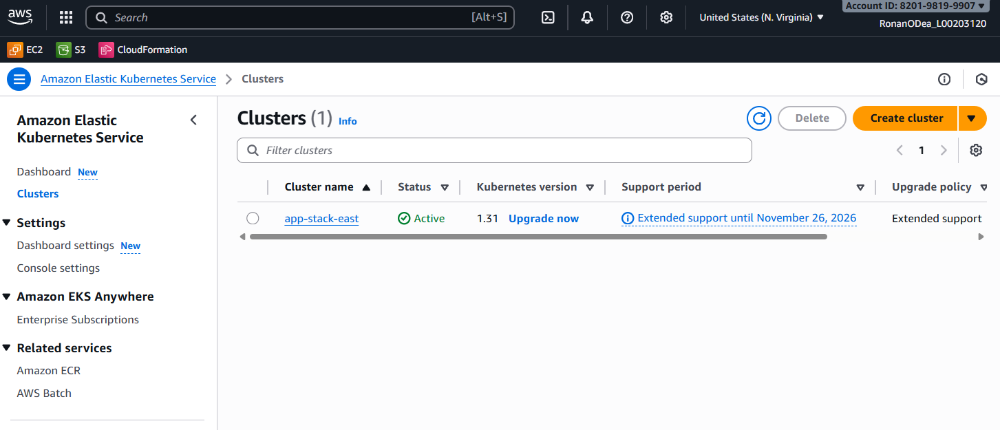
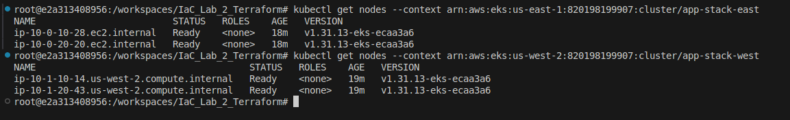
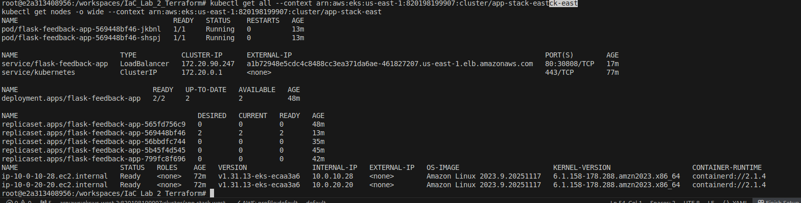
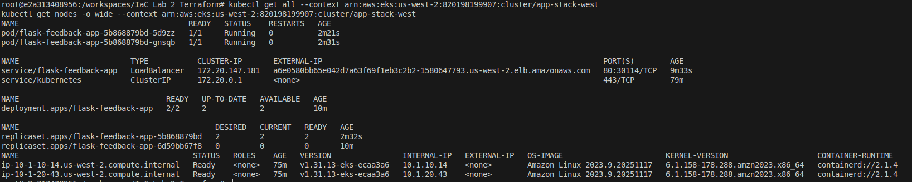
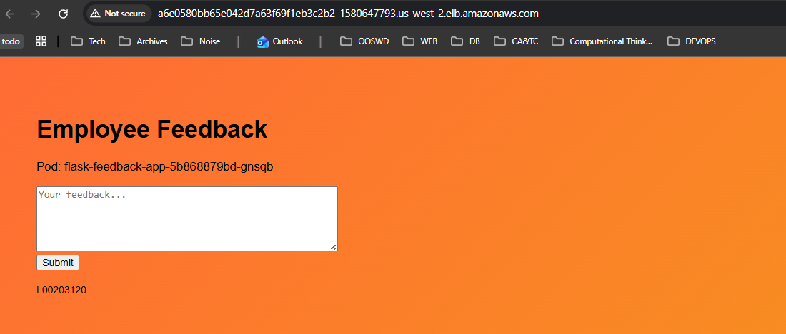

# IaC_Lab_2_Terraform

This project involved a 3 phase development approach which are archived in the repo's branches with more details pertaining to phase 1 and 2, this is to be commited to main. 

## Phase 1: Traditional EC2 Architecture
Goal: Deploy simple Flask app on EC2 instances across 2 AZs
Infrastructure:

- VPC: 10.0.0.0/16 (us-east-1)

2 Public Subnets (10.0.1.0/24, 10.0.2.0/24)
- 2 EC2 instances (t3.micro) running 

- Flask via user_data

- Internet Gateway for public access
- Security Groups (SSH + HTTP)
- Manual application deployment via user_data script

Web servers in public subnets (simple but less secure)
Working proof-of-concept, validated Terraform modules

## Phase 2: Cloud-Native EKS Architecture
Goal: Migrate to Kubernetes for better orchestration and scalability
Infrastructure Evolution:

- Added 2 Private Subnets (10.0.10.0/24, 10.0.20.0/24)

- Single NAT Gateway (cost optimization)

-EKS Cluster (Kubernetes 1.31)

- 2 Worker Nodes (t3.small) in private subnets

- Containerized Flask app in ECR
- AWS Load Balancer Controller 

- (Kubernetes-native)
Network Load Balancer (auto-provisioned by K8s Service)

EKS nodes in private subnets (better security), ALB via Kubernetes controller, multi-AZ redundancy

## Phase 3: Multi-Region Deployment with Terraform Stacks 




Phase 3 transforms the single-region deployment into a multi-region, highly available infrastructure using HCP Terraform Stacks. This eliminates the manual variable switching from Phase 2 and enables declarative multi-region deployments.

This stage empoyed a more declative approach to avoid overly complex variable passing

2 regions: us-east-1 (Virginia) and us-west-2 (Oregon)

4 EKS clusters: 2 per region 

Unified state management: Single stack managing all regions

Shared VPC/EKS components across regions


## HCP Terraform Stacks directory structure: 
``` bash
|   .dockerignore
|   .gitignore
|   .terraform-version
|   .terraform.lock.hcl
|   components.tfcomponent.hcl
|   deployments.tfdeploy.hcl
|   Dockerfile
|   oidc-trust.json
|   outputs.tfcomponent.hcl
|   providers.tfcomponent.hcl
|   README.md
|   variables.tfcomponent.hcl
|
+---.devcontainer
|       devcontainer.json
|       Dockerfile
|
+---app
|   |   app.py
|   |   requirements.txt
|   |
|   \---templates
|           index.html
|
+---archive
|   +---old-deployment-methods
|   +---old-modules
|   \---old-terraform-root
|           backend.tf
|           main.tf
|           outputs.tf
|           variables.tf
|
+---k8s
|       deployment.yaml
|       iam-policy.json
|       service-simple.yaml
|       service.yaml
|
\---screenshots
```

## Multi-Region Deployment Configuration:

``` hcl
identity_token "aws" {
  audience = ["aws.workload.identity"]
}
# Using OpenID Connect (OIDC) instead of static AWS credentials
deployment "production" {
  inputs = {
       # See iam-policy.json in project root for full permission set
    role_arn       = "arn:aws:iam::820198199907:role/HCP-Terraform-Stacks-Role"
    identity_token = identity_token.aws.jwt
    
    regions = {
      east = {
        region   = "us-east-1"
        vpc_cidr = "10.0.0.0/16"
        azs      = ["us-east-1a", "us-east-1b"]
      }
      west = {
        region   = "us-west-2"
        vpc_cidr = "10.1.0.0/16"
        azs      = ["us-west-2a", "us-west-2b"]
      }
    }
    
    cluster_version     = "1.31"
    node_instance_types = ["t3.small"]
    node_count          = 2
  }
  destroy = true  # ADD/REMOVE THIS LINE TO PLAN DESTROY
}
```

## Deployment Process

### Figure 1: HCP Terraform Stacks - Initial Plan



Configuration #24 ready to deploy 124 resources across 6 components (2 VPCs, 2 EKS clusters, S3, inputs)

### Figure 2: Successful Deployment - All Components Green



6 components deployed successfully with outputs showing cluster endpoints, VPC IDs, and kubectl commands

### Figure 3: us-west-2 VPC Resource Map



VPC 10.1.0.0/16 with 4 subnets across us-west-2a and us-west-2b, showing route tables and network connections

### Figure 4: Figure 5: us-east-1 EKS Cluster (app-stack-east)



Kubernetes 1.31 cluster active in N. Virginia

### Figure 5: us-west-2 EKS Cluster (app-stack-west)


Kubernetes 1.31 cluster active in Oregon

### Figure 6: kubectl - Nodes in Both Regions



4 total nodes: 2 in us-east-1 (us-east-1a, us-east-1b), 2 in us-west-2 (us-west-2a, us-west-2b)

### Figure 7: kubectl - East Cluster Workloads



2 pods running: a1b72948e5cdc4c8488cc3ea371da6ae-461827207.us-east-1.elb.amazonaws.com (now destroyed)

### Figure 8: Flask App - East Region


Application accessible via east ELB, serving from pod: flask-feedback-app-569448bf46-shspj

### Figure 9: kubectl - West Cluster Workloads



2 pods running: a6e0580bb65e042d7a63f69f1eb3c2b2-1580647793.us-west-2.elb.amazonaws.com (now destroyed)

### Figure 10: Flask App - West Region



Application accessible via west ELB, serving from pod: flask-feedback-app-5b868879bd-gnsqb

## Total Resources:

2 VPCs (multi-AZ, multi-region)

2 EKS clusters (Kubernetes 1.31)

4 EC2 nodes (t3.small)

4 application pods (Flask v4)

2 Load Balancers

1 S3 bucket (To be integrated into app)

1 ECR repository

_________________________________

## Kubectl Deployment Reference

### Configure Both Clusters
```bash
# East cluster
aws eks update-kubeconfig --region us-east-1 --name app-stack-east --alias eks-east

# West cluster
aws eks update-kubeconfig --region us-west-2 --name app-stack-west --alias eks-west
```

### Deploy to Both Regions
```bash
# East deployment
kubectl config use-context eks-east
kubectl apply -f k8s/deployment.yaml
kubectl apply -f k8s/service.yaml

# West deployment
kubectl config use-context eks-west
kubectl apply -f k8s/deployment.yaml
kubectl apply -f k8s/service.yaml
```

### Get Load Balancer URLs
```bash
# East
kubectl config use-context eks-east
kubectl get svc flask-feedback-app

# West
kubectl config use-context eks-west
kubectl get svc flask-feedback-app
```

### Verify Everything
```bash
# Check nodes (both clusters)
kubectl config use-context eks-east && kubectl get nodes
kubectl config use-context eks-west && kubectl get nodes

# Check pods (both clusters)
kubectl config use-context eks-east && kubectl get pods -o wide
kubectl config use-context eks-west && kubectl get pods -o wide
```
## Troubleshooting Commands
```bash
# Pod logs
kubectl logs -l app=flask-feedback-app --tail=50

# Events
kubectl get events --sort-by='.lastTimestamp'

# Describe service
kubectl describe svc flask-feedback-app

# Restart deployment
kubectl rollout restart deployment flask-feedback-app
```
Conclusion

- Successfully deployed multi-region infrastructure across US-EAST-1 and US-WEST-2

- AWS resources managed by single HCP Terraform Stack configuration
Evolved from EC2 (Phase 1) to EKS (Phase 2) to Multi-Region Stacks (Phase 3)

- Demonstrated High availability with 4 availability zones and 8 Flask pods

- OIDC authentication eliminates static credential passing

- Semi-Modular components enable reusability and rapid region expansion

- Infrastructure successfully tested and destroyed (cost management)

Student: Ronan O'Dea (L00203120) 

Repo: https://github.com/RODea-L00203120/IaC_Lab_2_Terraform