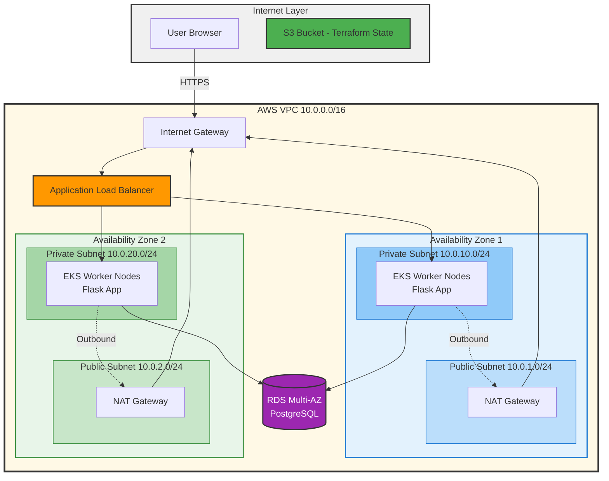

# IaC_Lab_2_Terraform
Repository in support of academic report for Lab 2's prescribed topic.

This repository provides a means of Version Control and evidences the following: 

The authors engagement in practitioner-based research in effort to compose a IaC solution for a hypothetical DevOps pipeline. 

- The proposed scenario is the provision of infrastructure for the deployment of a feedback mechanism for employees in an organization. 

- While the landing page is simplistic (a form), reliability, security, modularity and scalability are of concern and therefore the underlying architecture design aimed for is as follows:

# Infrastructure Architecture

# Early Design decisions: 

- Create a dev container for version locking, portability and maintainability.

- Use terraform locally through the CLI, avoid vendor locked cloud implementation and instead store state configuration files on a private S3 bucket. Less provider dependence, similar security, greater flexibility and portability.

- Modular design for: VPC, ALB, EKS clusters, RDS & Security Group configuration

- Simple Python Flask App - Hello world to begin, then form submission to DB

- Aiming to implement multi-cluster cluster approach; first get one cluster working

